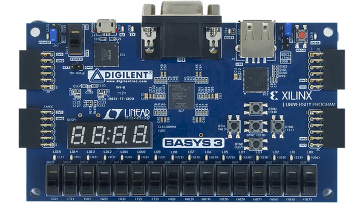

# Welcome to FPGA Projects Documentation

## Projects

* Vivado: 
    * Data Selector: [Data Selector](Vivdao/data_selector_verilog/data_selector.md)
    * Counter: [Counter](docs/Vivdao/counter_verilog/counter.md)
    * Decoder_7_Segement: [Decoder](docs/Vivdao/decoder_7_seg/decoder.md)
* ISE: [Perceptron]
    * Data Selector: [Data Selector](Vivdao/data_selector_verilog/data_selector.md)

